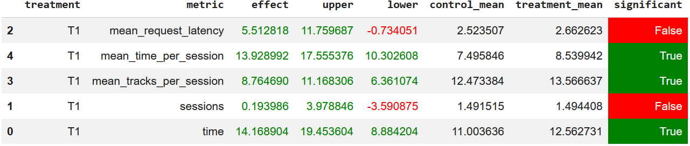

## Homework 2 Report

### Abstract
В качестве рекомендера обучена модель BERT4Rec из пакета RecTools, и реализованы item2item рекомендации. Дополнительно из рекомендаций к треку для разнообразия удалены треки того же исполнителя, оставлены только альтернативные исполнители.

### Детали
Для обучения было собрано 1034924 записи симулятора, данные собирались скриптом:
```
python -m sim.run --episodes 20000 --config config/env.yml multi --processes 5
```

Обучение модели реализовано в ноутбуке [hw2_solution.ipynb](./hw/hw2/hw2_solution.ipynb)

Записи симулятора фильтруются по time > 0.6, итого датасет для обучения содержит 446804 записи.
Также используются фичи треков из tracks.json: исполнитель, жанры, настроение, страна и год.

После обучения вычисляются I2I рекомендации, из полученных для каждого трека рекомендаций удаляются треки того же исполнителя, затем оставляются топ-10 рекомендаций.


### Результаты A/B эксперимента
По результатам A/B эксперимента модель побеждает рекомендер SasRec-I2I по mean_time_per_session:



A/B эксперимент проведён в ноутбуке [hw2_ab.ipynb](./hw/hw2/hw2_ab.ipynb)